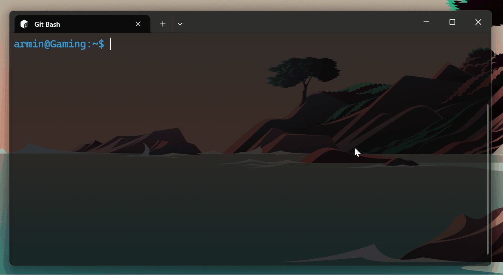

# Lumitide

A terminal music player for Tidal, written in Rust.

Stream lossless audio from your Tidal account directly in the terminal, with album art, a live spectrum visualizer, beat/drop detection, and in-app downloads.



`→/n` next &nbsp;`←/p` prev &nbsp;`Space` pause &nbsp;`↑/+` vol up &nbsp;`↓/-` vol down &nbsp;`d` download &nbsp;`r` radio &nbsp;`?` controls &nbsp;`q/Esc` quit or go back

## Features

- **Stream** lossless FLAC from Tidal in real time
- **Album cover art** rendered as Braille characters in the terminal
- **Spectrum visualizer** with peak-hold bars and beat/drop detection
- **Album-art color theming** — title, spectrum bars, and transition arrows all take their color from the current cover
- **Pywal integration** — optionally sync the color scheme with your [Pywal](https://github.com/dylanaraps/pywal) wallpaper palette
- **Mix mode** — browse and play your curated Tidal mixes with animated track transitions
- **Playlist mode** — browse and play your Tidal playlists
- **Radio** — press `r` on any track to start a Tidal radio seeded from it
- **Search** — find tracks by title
- **Local playback** — shuffle local FLAC, MP3, and M4A files with the same UI
- **Download** — save any streaming track to disk with a single keypress
- **Media key support** — control playback via hardware media keys and Bluetooth headsets; track metadata and album art shown in Windows taskbar/lock screen and macOS Control Center

## Requirements

- A [Tidal](https://tidal.com) HiFi or HiFi Plus subscription
- A terminal with **truecolor** (24-bit) support (Windows Terminal, iTerm2, Alacritty, Kitty, etc.)
- **Linux only:** D-Bus (included by default on all major desktop distributions)

## Installation

### Download (recommended)

Grab the latest release for your platform from the [Releases](https://github.com/BreakLime/lumitide/releases) page.

| Platform | File | Type |
|----------|------|------|
| Windows | `lumitide-installer.exe` | Installer — Start Menu shortcut, uninstaller, optional PATH |
| Windows | `lumitide-windows.exe` | Portable — just download and run, no install needed |
| Linux | `lumitide-linux` | Portable binary |
| macOS | `lumitide-macos` | Portable binary |

**Windows installer:** run `lumitide-installer.exe` and follow the wizard. Lumitide will appear in your Start Menu.

**Windows portable:** double-click `lumitide-windows.exe` or run it from a terminal.

**Linux / macOS:** make it executable first:
```sh
chmod +x lumitide-linux  # or lumitide-macos
./lumitide-linux
```

Optionally move it somewhere on your `PATH` so you can run it from anywhere:
```sh
mv lumitide-linux ~/.local/bin/lumitide
```

### Build from source

Requires the [Rust toolchain](https://rustup.rs).

```sh
git clone https://github.com/BreakLime/lumitide.git
cd lumitide
cargo build --release
./target/release/lumitide
```

**Linux** also needs the ALSA development headers:
```sh
sudo apt install libasound2-dev  # Debian / Ubuntu
sudo dnf install alsa-lib-devel  # Fedora
```

## Authentication

On first run, Lumitide opens a Tidal device-authorization flow:

```
To log in to Tidal, visit:
  https://link.tidal.com/...
And enter code: ABCD-1234

Waiting for authorisation...
```

Visit the URL, enter the code, and approve the login. Your session is saved to
`~/.config/lumitide/session.json` and refreshed automatically on subsequent
runs.

## Usage

Running `lumitide` with no arguments opens an interactive menu:

```
> Search
  My mixes
  Local files
  Config
  Quit
```

CLI usage is also fully supported:

```sh
lumitide search "Netsky"               # search tracks by title
lumitide search "Chase The Sun" -n 20  # increase result count
lumitide mix                           # browse and play your Tidal mixes
lumitide local                         # shuffle local audio files
lumitide config                        # open the config file in your editor
```

## Key Bindings

| Key | Action |
|-----|--------|
| `→` / `n` | Next track |
| `←` / `p` | Previous track |
| `Space` | Pause / resume |
| `↑` / `+` | Volume up |
| `↓` / `-` | Volume down |
| `d` | Download current track |
| `r` | Start radio from current track |
| `?` | Toggle controls overlay |
| `q` / `Esc` | Quit |

## Configuration

Run `lumitide config` to open the config menu. Settings are stored at
`~/.config/lumitide/config.json`.

| Field | Default | Description |
|-------|---------|-------------|
| `output_dir` | — | Directory for downloaded tracks (set on first run) |
| `volume` | `0.5` | Playback volume (0.0–1.0, saved across sessions) |
| `cover_size` | `640` | Album art fetch size in pixels |
| `search_limit` | `10` | Default number of search results |
| `drop_detection` | `true` | Enable beat/drop detection and color cycling |
| `always_color` | `true` | Always show album-art colors (not only during drops) |
| `pywal` | `false` | Use [Pywal](https://github.com/dylanaraps/pywal) palette instead of album-art colors (reads `~/.cache/wal/colors.json` on all platforms) |
| `calm_mode` | `false` | Static spectrum shape, no drop/beat effects |
| `show_controls_hint` | `true` | Show "Press ? for ctrl" hint in the corner |

## Performance

Lumitide is built for low resource usage. Typical figures on a modern machine:

| Metric | Idle | Playing |
|--------|------|---------|
| CPU | < 1% | 1–3% |
| RAM | ~5 MB | ~10 MB |

If RAM usage matters (e.g. on a low-power device), enabling `calm_mode` in config skips the beat/drop analysis thread entirely, keeping usage closer to the idle figure.

## Legal

Lumitide is an unofficial client. Use it only with a valid Tidal subscription and in accordance with [Tidal's Terms of Service](https://tidal.com/terms).

The app credentials bundled in `src/auth.rs` are the same public credentials used by [python-tidal](https://github.com/tamland/python-tidal) and other open-source Tidal clients. They are not personal credentials.

## License

MIT — see [LICENSE](LICENSE).
